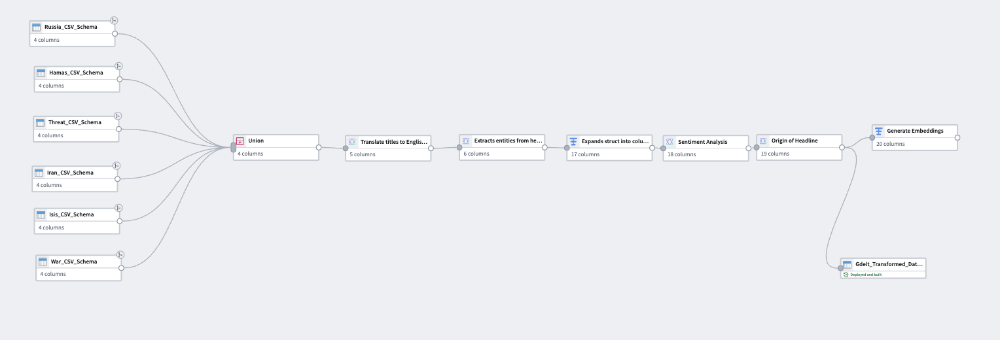

# Open Source Intelligence Q&A Bot (RAG)

## Overview

The Open Source Intelligence Q&A Bot is a Retrieval-Augmented Generation (RAG) system designed to support analysts in querying and understanding open-source geopolitical data. Users can input natural language questions and receive concise, grounded answers generated by a large language model (LLM), supported by relevant context retrieved from the GDELT dataset.

This project was developed as part of the **Palantir Winter Defense Tech Fellowship**, where it was ranked among the **top 3% of submissions** and selected for presentation at **Palantir's Washington, D.C. office**.

## RAG Architecture

This project follows a true Retrieval-Augmented Generation pipeline:

1. **Data Chunking**: Structured entries from GDELT are concatenated into rich context strings and split into smaller, semantically meaningful chunks.
2. **Embedding Generation**: Each chunk is encoded into a high-dimensional vector using the `Text_Embedding_3_Large` model.
3. **Query-Time Retrieval**: When a user poses a question, it is embedded and compared to all document chunks using cosine similarity to retrieve the most relevant content.
4. **Answer Generation**: Retrieved content is inserted into a prompt and passed to GPT-4o, which generates a coherent, contextually grounded answer, optionally citing specific headlines.

This ensures factual accuracy, minimizes hallucinations, and keeps responses anchored in real geopolitical reporting data.

## Features

- Generate dataset-wide summaries identifying key geopolitical topics and entities.
- Ask natural language questions and receive answers grounded in retrieved evidence.
- Cite source headlines (via `Translated_Headline`) for traceability and transparency.
- Maintain conversation continuity through session history.
- Efficiently search large volumes of threat-related content using vector retrieval.

## Technical Stack

- **Language Model**: GPT-4o
- **Embedding Model**: Text_Embedding_3_Large
- **Retrieval**: Cosine similarity on precomputed chunk embeddings
- **Frontend**: Streamlit (interactive demo)
- **Platform**: Palantir Foundry + AIP (required for full functionality)
- **Data Source**: GDELT (filtered by Russia, Iran, ISIS, Hamas, War, and Threat topics)

## Data Pipeline

A robust data pipeline was built in **Palantir Foundry** to prepare the dataset for retrieval and generation. Key transformations include:

1. Union of threat-relevant datasets (e.g., Russia, Iran, ISIS, Hamas).
2. Translation of headlines to English.
3. Entity extraction (people, organizations, locations, etc.).
4. Expansion of struct fields for better readability.
5. Sentiment scoring of translated headlines.
6. Origin labeling to trace headline provenance.
7. Generation of chunked text and document-level embeddings.

### Pipeline Diagram

## Demo

To view a walkthrough and live demonstration of the system in action, visit the video below:

[Watch the YouTube Demo](https://www.youtube.com/watch?v=79PtH75LJiU)

## Important Note

This application is fully integrated with Palantir Foundry and leverages proprietary services, including LLM access, translation APIs, and internal embedding infrastructure. As such, this codebase will **not function outside the Foundry environment** without major reimplementation using open-source equivalents (e.g., Hugging Face, FAISS, LangChain).

## Acknowledgments

This project was completed under the mentorship and support of the **Palantir Winter Defense Tech Fellowship**. Special thanks to the mentors, engineers, and fellows who provided technical guidance and feedback throughout the development lifecycle.
